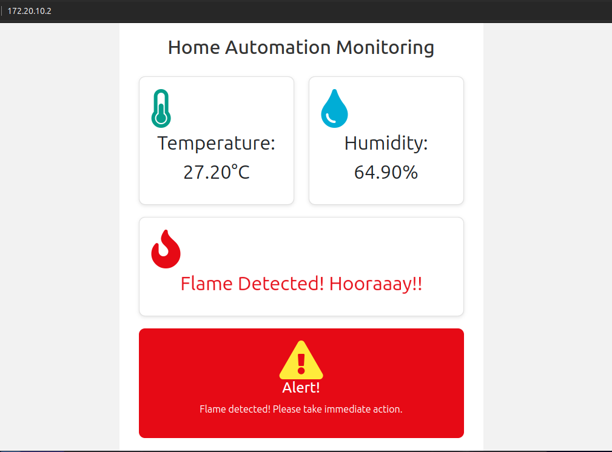

# Home Automation and Monitoring System

## Table of Contents
- [Description](#description)
- [Features](#features)
- [Hardware Setup](#hardware-setup)
- [Usage](#usage)
- [Contributing](#contributing)

## Description
The Home Automation and Monitoring System is a project aimed at automating and monitoring various aspects of your home, such as temperature, humidity, and flame detection. It provides real-time data about the environmental conditions in your home and allows you to control and monitor them remotely.

The system integrates with different sensors and actuators to gather data and perform actions based on predefined rules and user preferences. It offers a web-based user interface where users can view the data, receive alerts, and interact with the automation features.

## Features
- Real-time monitoring of temperature, humidity, and flame detection.
- Remote control of home automation devices.
- Alert notifications for critical events.
- User-friendly web interface for easy interaction.
- Expandable and customizable with support for additional sensors and actuators.

## Hardware Setup
To set up the hardware components of the Home Automation and Monitoring System, you will need the following:

- ESP8266 microcontroller board
- Temperature and humidity sensor (e.g., DHT11 or DHT22)
- Flame detection sensor
- Wires for connecting the sensors to the ESP8266

Follow these steps to set up the hardware:

1. Connect the temperature and humidity sensor to the ESP8266 using appropriate wires. Refer to the datasheet or documentation of your sensor for pin connections.
2. Connect the flame detection sensor to the ESP8266 using appropriate wires. Again, refer to the datasheet or documentation of your sensor for pin connections.
3. Ensure that all connections are secure and properly connected.
4. Power up the ESP8266 and the sensors.

## Usage
1. Access the web interface by opening `http://localhost:ip address provided by the ESP8266` in your web browser.
2. View the real-time data on temperature, humidity, and flame detection.
3. Control home automation devices through the web interface.
4. Configure alerts and notifications for critical events.
5. Customize the system settings according to your preferences.

## Contributing
Contributions are welcome! If you'd like to contribute to this project, please follow these steps:
1. Fork the repository.
2. Create a new branch for your feature or bug fix: `git checkout -b feature-name`
3. Commit your changes: `git commit -am 'Add new feature'`
4. Push to the branch: `git push origin feature-name`
5. Submit a pull request detailing your changes.

## Acknowledgments
We would like to acknowledge the contributions of the open-source community and the developers of the libraries and frameworks used in this project.

## Contact
For any inquiries or feedback, please contact me at [mahmoud.althaqel@gmail.com]

Thank you for using the Home Automation and Monitoring System!