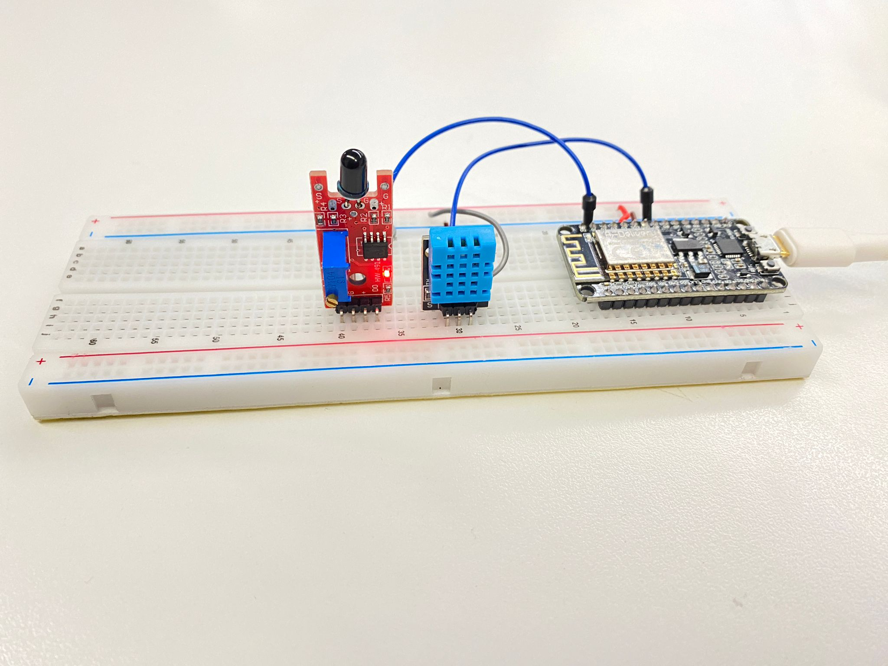
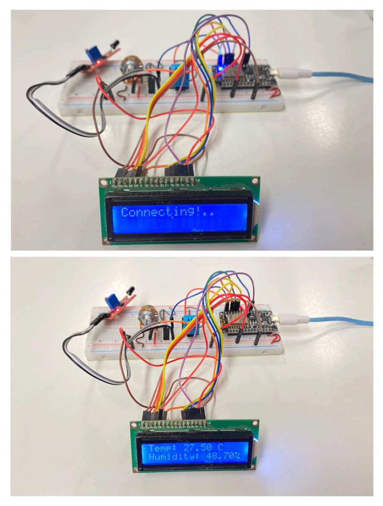
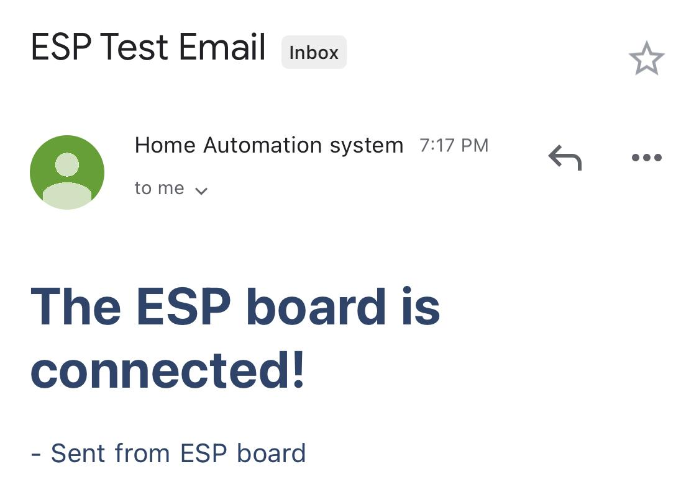
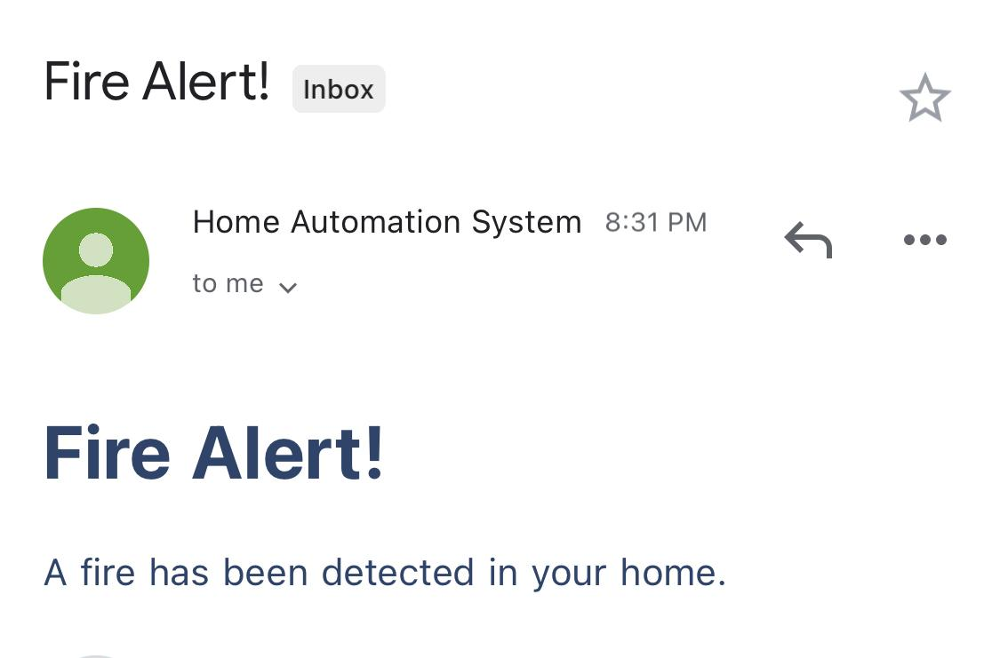

# Home Automation and Monitoring System


## Table of Contents
- [Description](#description)
- [Features](#features)
- [Hardware Setup](#hardware-setup)
- [Installation](#Installation)
- [Usage](#usage)
- [Blynk App Integration] (#Blynk App Integration)
- [Contributing](#contributing)


## Description
The Home Automation and Monitoring System is a project aimed at automating and monitoring various aspects of your home, such as temperature, humidity, and flame detection. It provides real-time data about the environmental conditions in your home and allows you to control and monitor them remotely.

The system integrates with different sensors and actuators to gather data and perform actions based on predefined rules and user preferences. It offers a web-based user interface where users can view the data, receive alerts, and interact with the automation features.

## Features
- Real-time monitoring of temperature, humidity, and flame detection.
- Remote control of home automation devices.
- Alert notifications for critical events, including email notifications.
- User-friendly web interface for easy interaction.
- Expandable and customizable with support for additional sensors and actuators.


## Hardware Setup
To set up the hardware components of the Home Automation and Monitoring System, you will need the following:

- ESP8266 microcontroller board
- Temperature and humidity sensor (e.g., DHT11 or DHT22)
- Flame detection sensor
- Liquid Crystal Display (LCD): Provides visual output for sensor readings and system status.
- Wires for connecting the sensors to the ESP8266

<div align="center">
  
  
</div>

Follow these steps to set up the hardware:

## Installation

1. Clone the repository to your local machine:
```shell
git clone https://github.com/mahmoudali2/Home-Automation-and-Monitoring-System.git
```

2. Open the project in your preferred Arduino development environment.

3. Install the required libraries:

- ESP8266WiFi
- ESPAsyncTCP
- ESPAsyncWebServer
- Adafruit_Sensor
- DHT
- FS
- ArduinoJson
- LiquidCrystal

4. Connect the ESP8266 microcontroller and other sensors according to the wiring diagram provided. Refer to the datasheet or documentation of your sensor for pin connections.

5. Configure the Wi-Fi credentials by modifying the `ssid` and `password` variables in the code.

6. Upload the code to the ESP8266 microcontroller.

7. Once uploaded, open the serial monitor to view the system's IP address.

8. Access the system by entering the IP address in a web browser.


## Usage
1. Access the web interface by opening `http://localhost:ip address provided by the ESP8266` in your web browser.
2. View the real-time data on temperature, humidity, and flame detection.
3. The LCD display connected to the system will also display the sensor readings.
4. Control home automation devices through the web interface.
5. Configure alerts and notifications for critical events, including email alerts.
6. Customize the system settings according to your preferences.
7. Additional sensors and functionalities can be integrated into the system by extending the codebase.

<div align="center">
  
  
</div>

## Blynk App Integration

The Home Automation and Monitoring System can be further enhanced by integrating it with the Blynk mobile app. The Blynk app provides a user-friendly interface for monitoring and controlling the system remotely from your smartphone.

To integrate the system with the Blynk app, follow these steps:

1. Download and install the Blynk app from the App Store or Google Play Store.

2. Create a new Blynk project in the app.

3. Obtain the authentication token for your Blynk project.

4. Modify the Arduino code to include the Blynk library and configure the Wi-Fi and Blynk credentials.

5. Add the necessary Blynk widgets to the Blynk project to display sensor data, control devices, and receive notifications.

6. Upload the modified code to the ESP8266 microcontroller.

7. Open the Blynk app and connect to your Blynk project using the authentication token.

You can now monitor and control your Home Automation and Monitoring System from the Blynk app on your smartphone.


## Contributing
Contributions to this project are welcome. Feel free to open issues and submit pull requests to enhance the functionality, add new features, or fix any bugs.

## Acknowledgments
We would like to acknowledge the contributions of the open-source community and the developers of the libraries and frameworks used in this project.

- [Arduino](https://www.arduino.cc/) - Open-source electronics platform.
- [ESP8266 Community](https://github.com/esp8266/Arduino) - ESP8266 core for Arduino.
- [Adafruit Industries](https://github.com/adafruit) - Libraries for supporting sensors.
- [ESPAsyncWebServer](https://github.com/me-no-dev/ESPAsyncWebServer) - Asynchronous web server library for ESP8266.


## Contact
For any inquiries or feedback, please contact me at [mahmoud.althaqel@gmail.com].